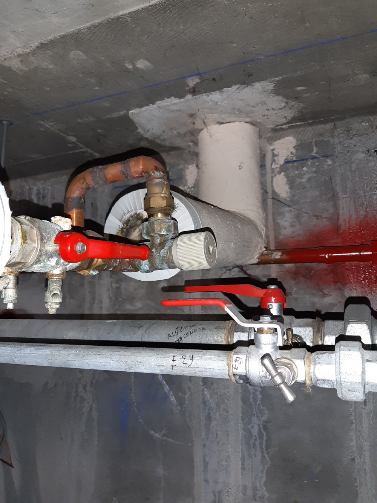

# plan du bâtiment et des réseaux de chauffage

## chaufferie - schéma électrique

[plan chaufferie](Chaufferie_CEREMA_20180312.PDF)

## bâtiment administratif
- 2 étages, plus un sous-sol non-chauffé
- 550 m2

## bâtiment technique
- bureaux : 1100 m2
- laboratoires : 1500 m2
- circulation : 600 m2, dont un grand couloir de 100 mètres de long

# vannes de réglage de pression différentielle dans vide sanitaire 

