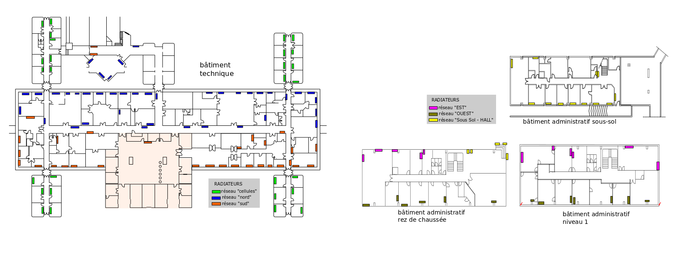
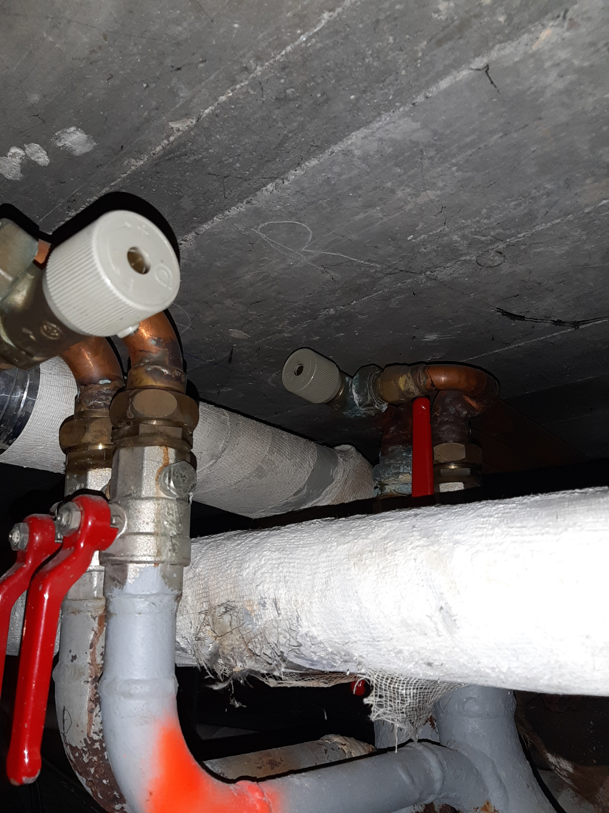
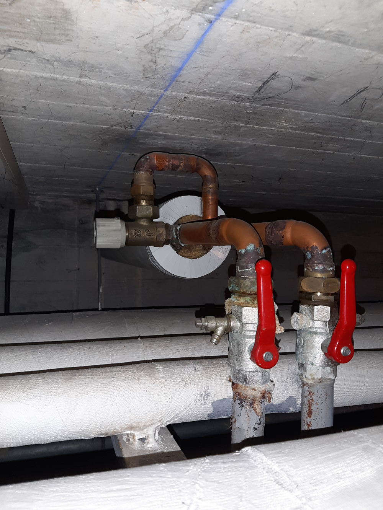

# plan du bâtiment et des réseaux de chauffage

## bâtiment administratif 
- 2 étages, plus un sous-sol non-chauffé
- 550 m2

## bâtiment technique
- bureaux : 1100 m2
- laboratoires : 1500 m2
- circulation : 600 m2, dont un grand couloir de 100 mètres de long

# vannes d'équilibrage dans vide sanitaire 

